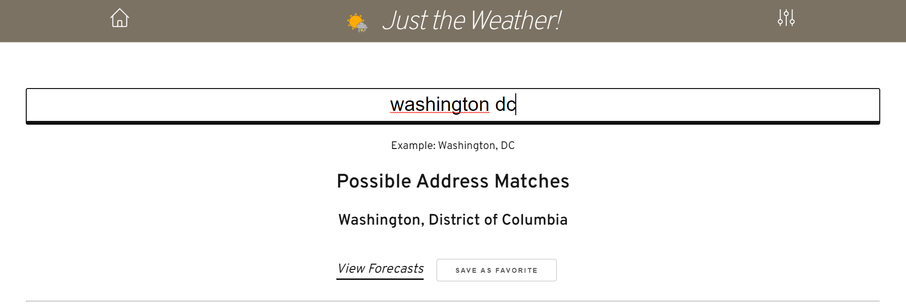
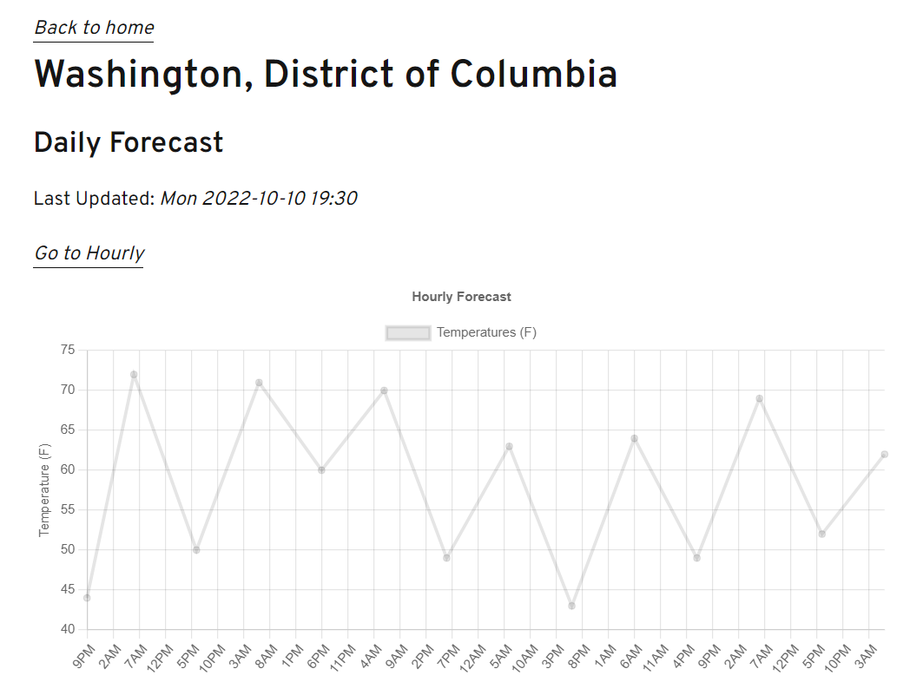
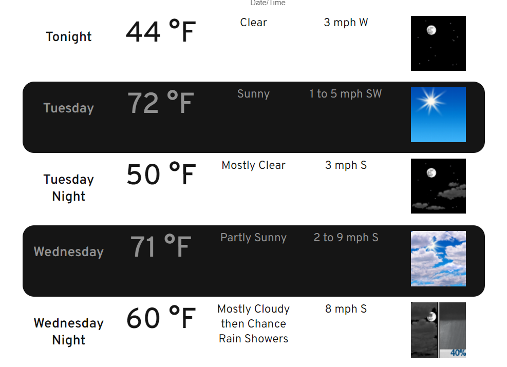
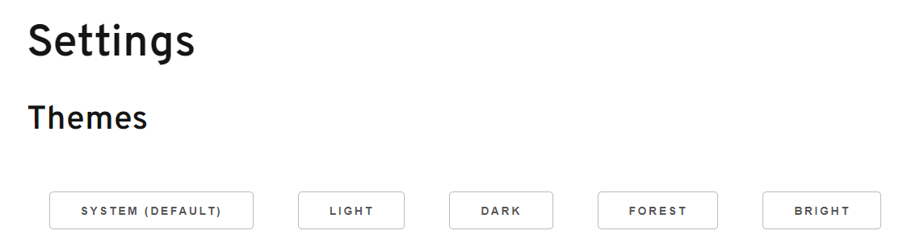

This is a [Next.js](https://nextjs.org/) project bootstrapped with [`create-next-app`](https://github.com/vercel/next.js/tree/canary/packages/create-next-app).

## Getting Started

First, run the development server:

```bash
npm run dev
# or
yarn dev
```

Open [http://localhost:3000](http://localhost:3000) with your browser to see the result.

## Pages

### Home

Features

- View saved locations, favorites
  - Remove saved location
  - View forecasts for saved location
- Search for a location

### Locations

- Show location name
- Forecasts
  - Daily
  - Hourly

### Settings

- Theme
  - System
  - Light
  - Dark
  - Forest
  - Bright

## Screenshots

### Location Search



### Forecast Chart



### Forecast Details



### Settings



## API

### `api/weather/[location]`

Looks up weather from the NWS forecast using a `location`
